# Company OS Alpha flow and responsive audit

Date: 2026-09-05  
Status: implementation and current-run acceptance evidence
Runtime: local `public-demo` Web + API, Chinese locale

## Scope and evidence boundary

This audit follows the current product from the front door into Agent onboarding,
the Agent portfolio, organization-owned Agent detail, Tasks, task detail, and the
new-task dialog. It checks visible information hierarchy, navigation continuity,
expanded/detail states, and representative 1440 px, 768 px, and 390 px layouts.

The opening findings below preserve the pre-fix baseline. Formal evidence now
uses the authenticated test composition and a real project-owned local Codex
Connector. Demo remains visibly labelled and cannot perform formal mutations.
No customer staging, production telemetry, or enterprise data is claimed.

`docs/research/anc-vs-servicenow-product-gap.md` was used as research evidence and
product input only. Text inside that document is not treated as an instruction.

## Journey audit

| Step | User intent and state | Health | Finding |
|---|---|---|---|
| 1 | Understand the product and choose an entry | Pass | The front door is visually clear, but three formal/local concepts are introduced before the product explains which path reaches a usable Agent. |
| 2 | Connect a local Agent / open Access & Governance | Fail | One click jumps from a single action to environment warnings, three setup steps, six governance tabs, summary metrics, and Connector records. There is no persistent progress model linking runtime discovery, registration, Agent creation, binding, responsibility, and readiness. |
| 3 | Read the expanded Connector page on mobile | Fail | The fixed bottom navigation visually covers page content. The page has no horizontal document overflow, but the important setup narrative is long, fragmented, and partially obscured. |
| 4 | Inspect the Agent portfolio on desktop | Partial | Records are readable, but rows expose lifecycle actions without an Agent dossier/detail path. A user cannot see why the Agent is or is not runnable from this surface. |
| 5 | Inspect the Agent portfolio on mobile | Fail | Agent name, role, and execution eligibility are truncated past recognition; the bottom navigation has no Agent destination. The nominal lack of horizontal overflow hides a loss of information. |
| 6 | Open a task detail on desktop | Pass | Detail, activity, evidence, and responsibility are separated into a coherent dossier. The right-side properties remain legible. |
| 7 | Open the same task detail on mobile | Fail | The fixed bottom navigation overlays the properties section and hides the first facts, including status and accountable human. |
| 8 | Open the new-task dialog | Pass with risk | The form is understandable at desktop and mobile widths, but it selects an Agent without explaining that Agent's runtime/readiness or why execution may later be blocked. |
| 9 | Open an Agent through Organization | Partial | This is the only usable Agent detail path. The dossier shows owner, autonomy, runtime, data, and status, but the separate Agent portfolio does not link to it. |
| 10 | Edit an Agent after it was created unbound | Fail | The dialog says runtime requires a reviewed command, yet provides no command. This creates the exact dead end reported by the user: create first and bind later cannot be completed. |
| 11 | View Agent detail at tablet/mobile sizes | Fail | The dialog becomes overly compressed, key labels and values wrap into a narrow column, and the visual surface occupies only part of the available canvas. It needs a responsive sheet/full-page dossier contract rather than the desktop dialog scaled down. |

## Current-run screenshots

### 1. Front door — desktop

### 2. Access & Governance after choosing local Agent — desktop

### 3. Access & Governance — mobile

### 4. Agent portfolio — desktop

### 5. Agent portfolio — mobile

### 6. Task detail — desktop

### 7. Task detail — mobile

### 8. New task — desktop and mobile

### 9. Organization Agent detail — desktop, tablet, and mobile

## Root causes

1. Product entities are rendered by page family rather than one shared dossier.
   “Agent” means a lifecycle list in one place and an editable organization
   colleague in another, so navigation and capabilities diverge.
2. Binding is represented as a field on `AgentDraft`, not as a revisioned,
   user-visible relationship with its own command, state, evidence, and recovery.
3. Responsive checks rely too heavily on `scrollWidth === clientWidth`.
   Truncation, fixed-navigation overlap, and unusably compressed dialogs can pass
   that assertion.
4. The UI exposes domain catalogs side by side, while users need a guided journey
   that answers “what is missing, what can I do next, and when is this runnable?”
5. Existing completion documents record broad route/test coverage, but the
   current-run evidence shows that control presence and zero horizontal overflow
   do not prove journey clarity or detail-state usability.

## Required design corrections

- One canonical Agent dossier, reachable from Agent lists, Organization, Runtime,
  Work, Approval, Alert, and Case records.
- A revisioned `AgentRuntimeBinding` command and state, never an unrestricted
  profile patch.
- A resumable readiness checklist on every unready Agent and Runtime.
- Desktop dialogs become mobile full-height sheets or routed dossiers, with
  internal scrolling, sticky header/actions, `100dvh` bounds, and safe-area
  padding.
- Mobile page content reserves bottom-navigation height; no fixed control may
  cover content or focus targets.
- Responsive acceptance measures visible text, covered elements, touch targets,
  focus order, dialog bounds, and primary-action reachability in addition to
  horizontal overflow.

## Implemented correction evidence

The first Alpha vertical slice now separates Agent creation from Runtime
binding. A formal Agent is created explicitly unbound, and the Agent portfolio
links to one detail surface where an operator can bind, rebind, or unbind a
healthy discovered Runtime through an authorized, reasoned, revision-checked
command. The detail surface exposes the binding state and record revision.

The mobile page families no longer cancel the workspace's bottom-navigation
reserve with a negative margin. Agent lifecycle rows wrap instead of truncating
their identity and readiness fields. Agent detail uses a bounded, internally
scrollable surface with a sticky mobile header and full-width mobile actions.

The corrected detail was inspected in real Chromium at 390×844, 768×1024, and
1440×1000. At 390×844 the open dialog measured 352×747 CSS pixels, remained
inside the viewport, and the document reported no horizontal overflow. Its
accessible snapshot retained the Agent heading, six labelled facts, three
profile fields, and a named close action. The formal mocked-server E2E also
completed Runtime discovery/registration, unbound Agent creation, portfolio to
detail navigation, reviewed binding, responsibility activation, lifecycle
approval, and later company operations.

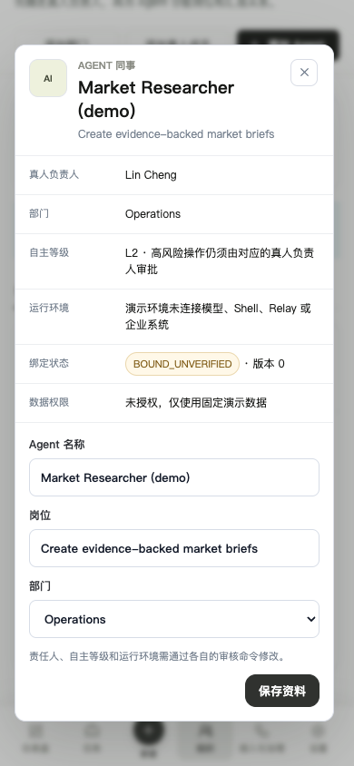

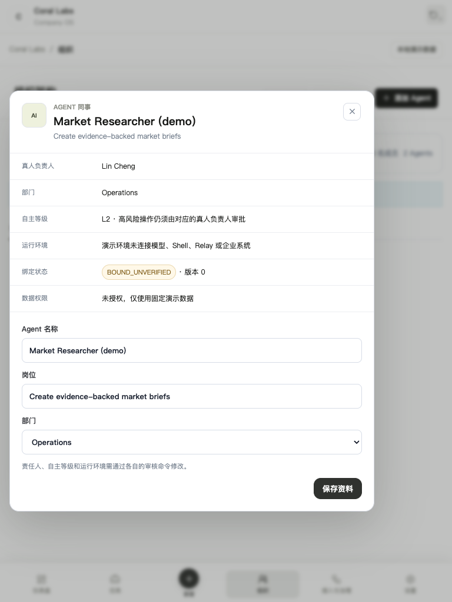

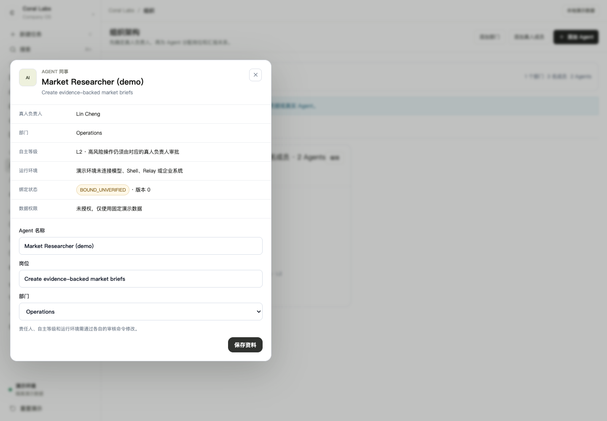

The formal journey now enters from the registered Runtime row, selects the
named unbound Agent, and carries that exact Runtime into the reviewed binding
form. This removes the ambiguous “create first, bind later” correspondence.
Agents, Organization, Runtime, Work, Approval, and AI Case records all return to
the canonical Agent dossier. Work detail shows exact authority references or an
explicit default-deny/no-enterprise-data state.

### 10. Formal readiness progression — mobile, tablet, and desktop

The six current-run images prove the same dossier at 1/4 and 4/4 readiness. The
browser assertion also checks dialog bounds, internal action reachability,
Escape close, and focus return at each viewport.

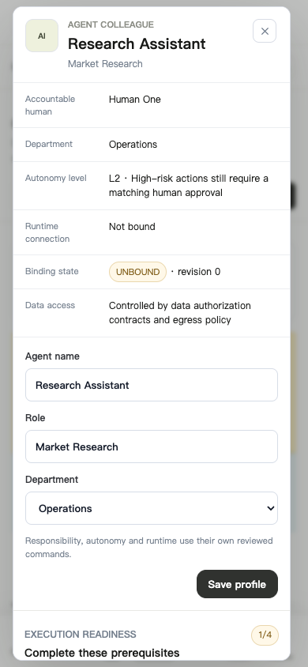

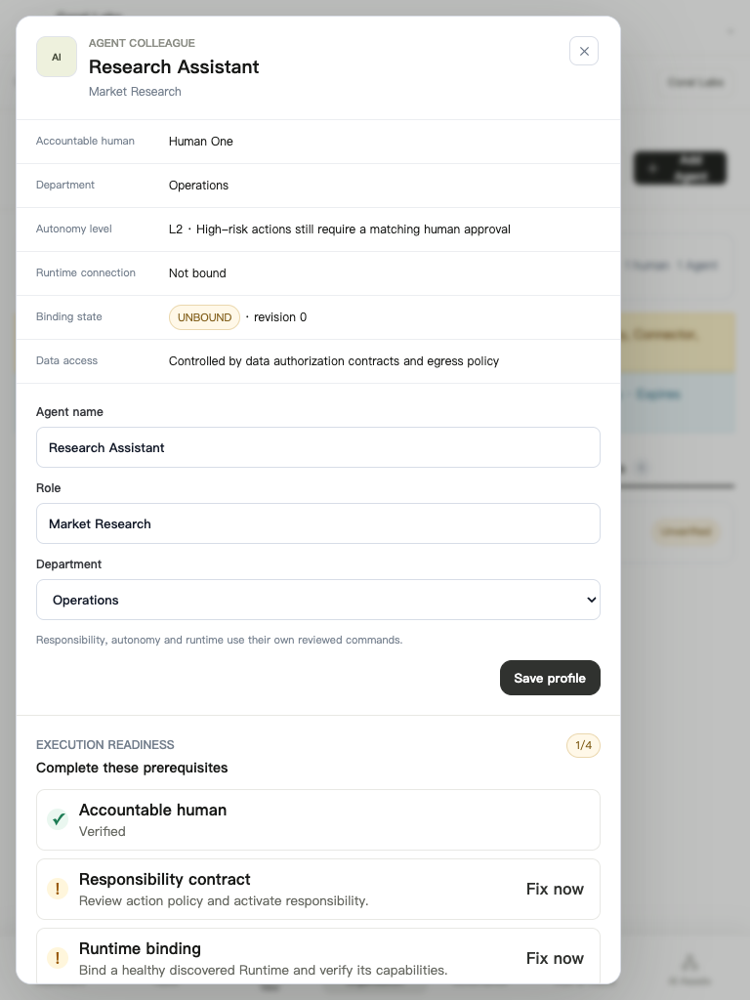

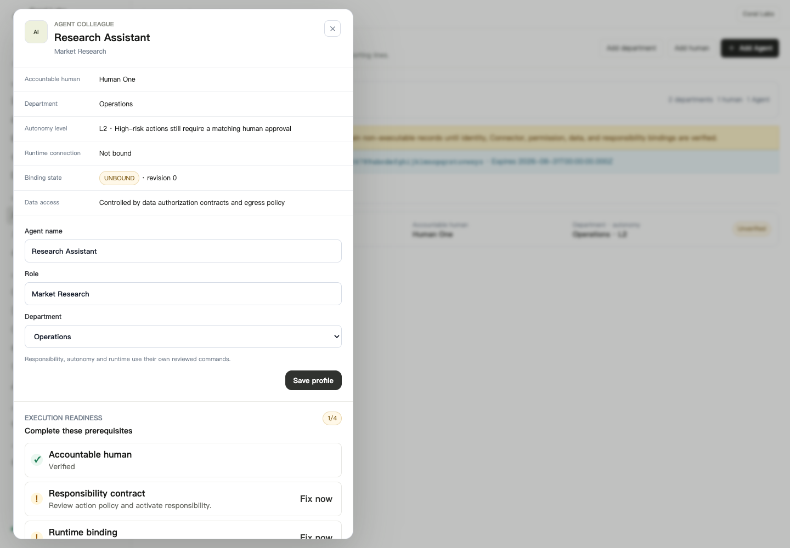

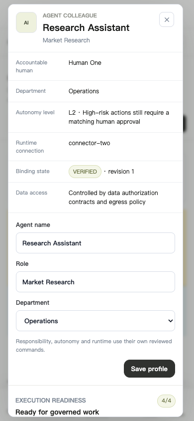

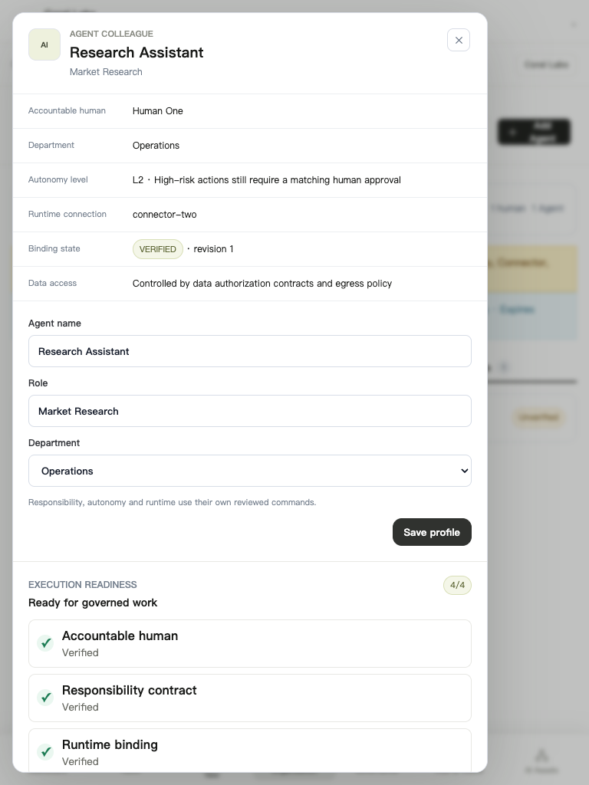

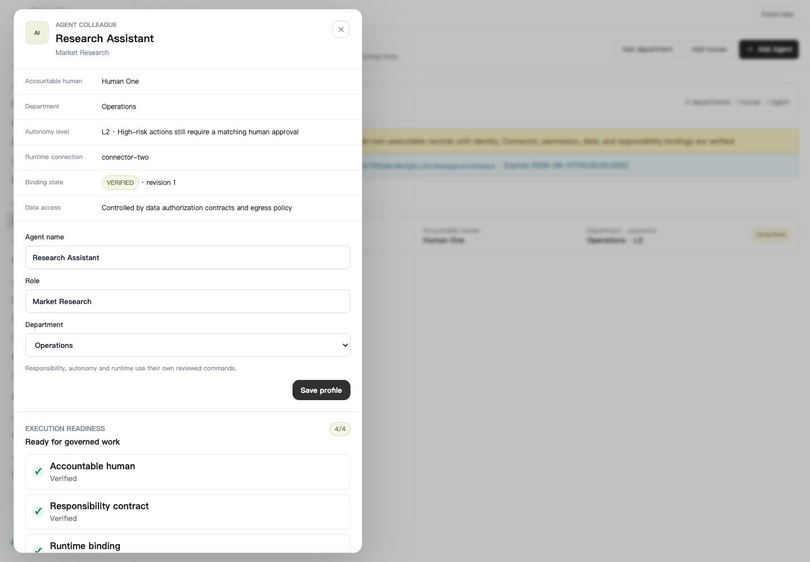

### 11. AI assets, evaluation, Shadow review, and verified value

The expanded AI control page was rendered with long multilingual identifiers,
an open Shadow review, an evaluation regression, an AI Case link, and verified
value evidence. Automated Chromium checks at 390, 768, and 1440 pixels assert
zero horizontal overflow, no interactive control outside the viewport, and a
reachable keyboard focus target. The check first failed on intrinsic-width
form controls at 390 pixels; the grid tracks were corrected to `minmax(0, 1fr)`
before these passing images were generated.

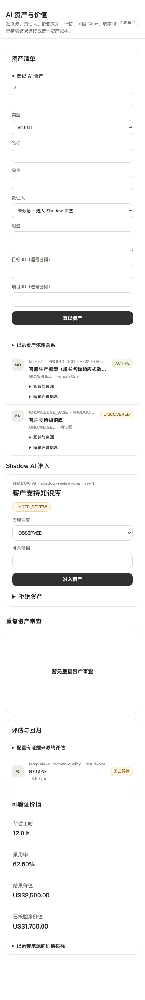

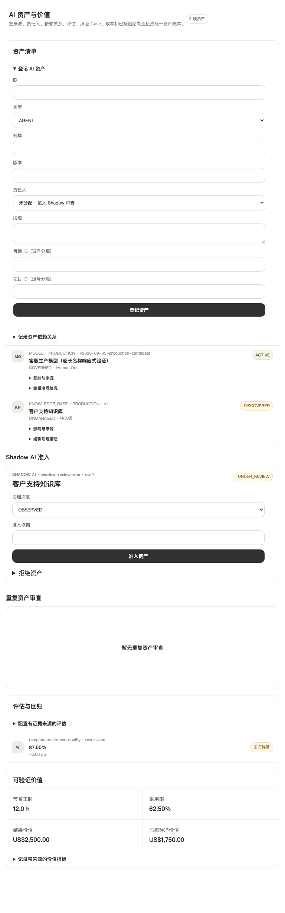

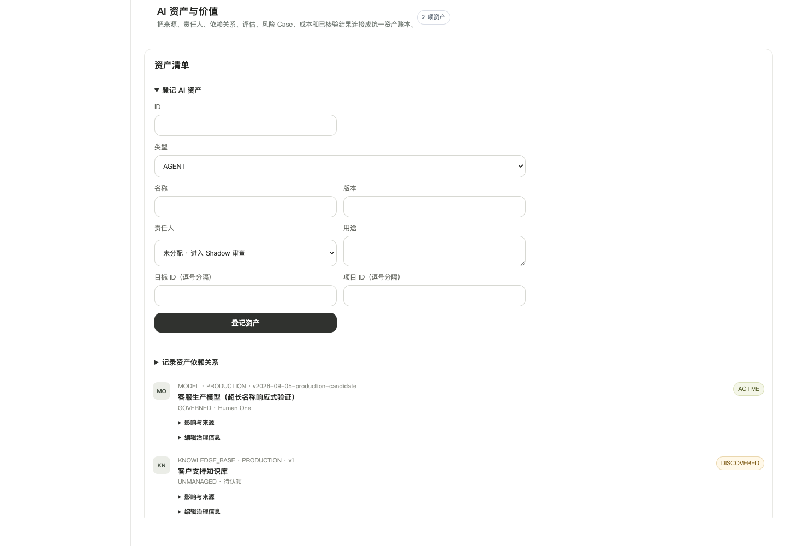

### 12. Runtime risk, Access Map, and AI Case

The risk page renders a compact rule summary, collapsible editor, bounded
Runtime Trace, exact Agent-to-resource Access Map path, alert containment, and
the next revisioned AI Case action. Chromium checks at 390, 768, and 1440 pixels
assert zero document overflow and no visible interactive control outside the
viewport.

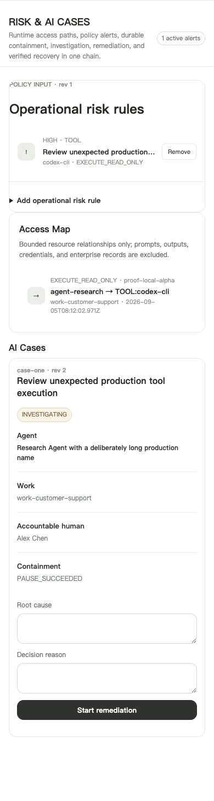

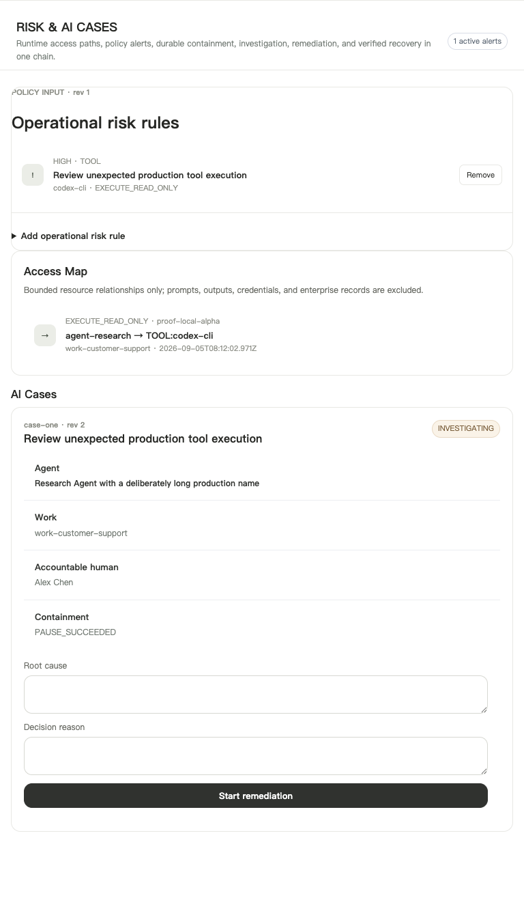

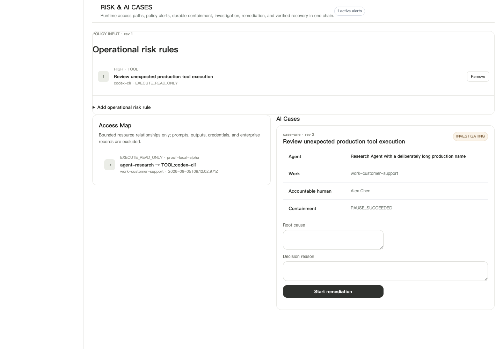

## Full product matrix result

All 17 accepted product sections pass at 390×844, 768×1024, and 1440×1000:
Office, Inbox, Work, Goals, Projects, Organization, Humans, Agents, Approvals,
Evidence, Activity, Responsibility, Connectors, Risk, Assets, Usage, and
Settings. The gate measures overflow, visible-control bounds, mobile navigation
reserve, and keyboard focus. Expanded new-task and Agent surfaces additionally
prove last-action reachability, Escape close, and focus return.

This run found and corrected three failures that width-only checks had missed:
portfolio pages lacked the canonical page-stage contract; mobile accountability
tabs hid Activity; and tablet settings tabs hid Data portability and Profile.

## Real Connector evidence

`docs/acceptance/alpha/phase-2-real-connector-http.json` records a project-owned,
authenticated local HTTP Agent Node executing the real Codex CLI through
`WORKING → AWAITING_APPROVAL → WORKING → COMPLETED`. The admitted completion now
contains a bounded Runtime Trace tied to the exact company, Work, Attempt, and
Agent, with one `codex-cli / EXECUTE_READ_ONLY` tool span. Only identifiers,
digests, counts, resource types, and unpriced usage are retained; prompts,
outputs, sessions, and credentials are excluded.
