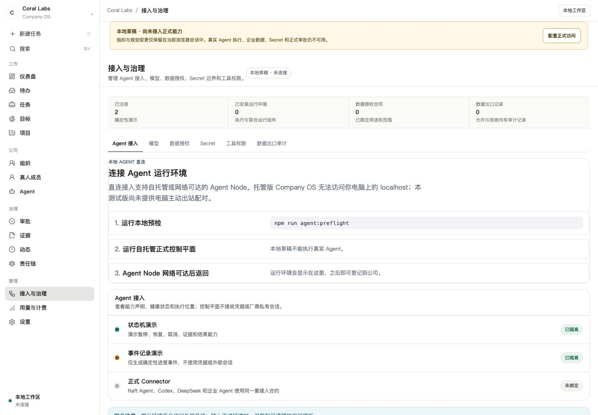
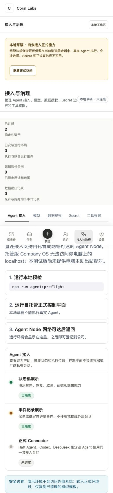
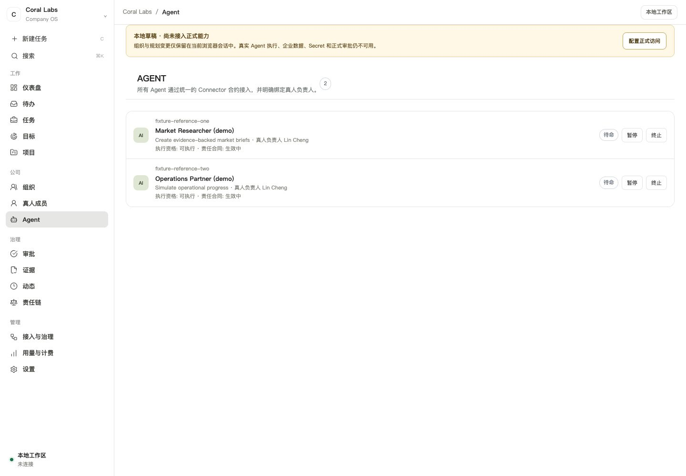
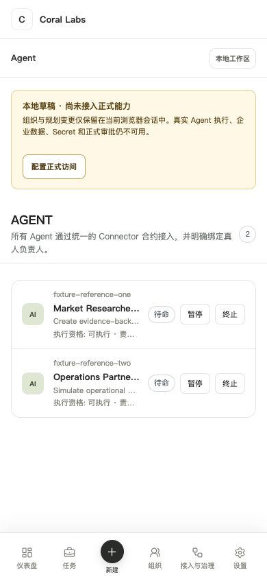
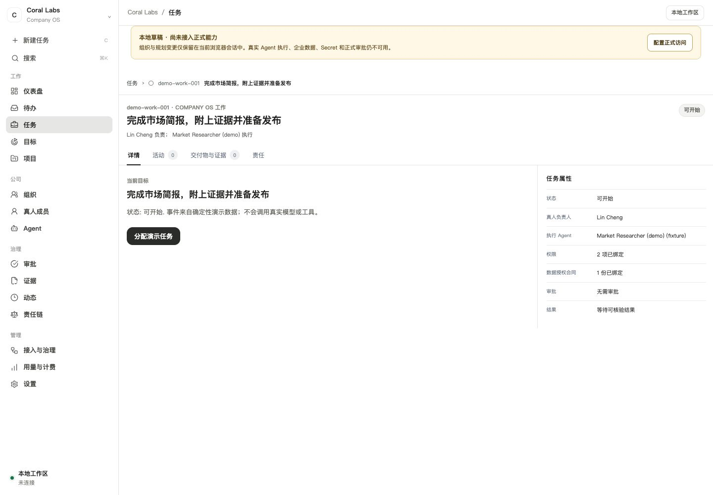
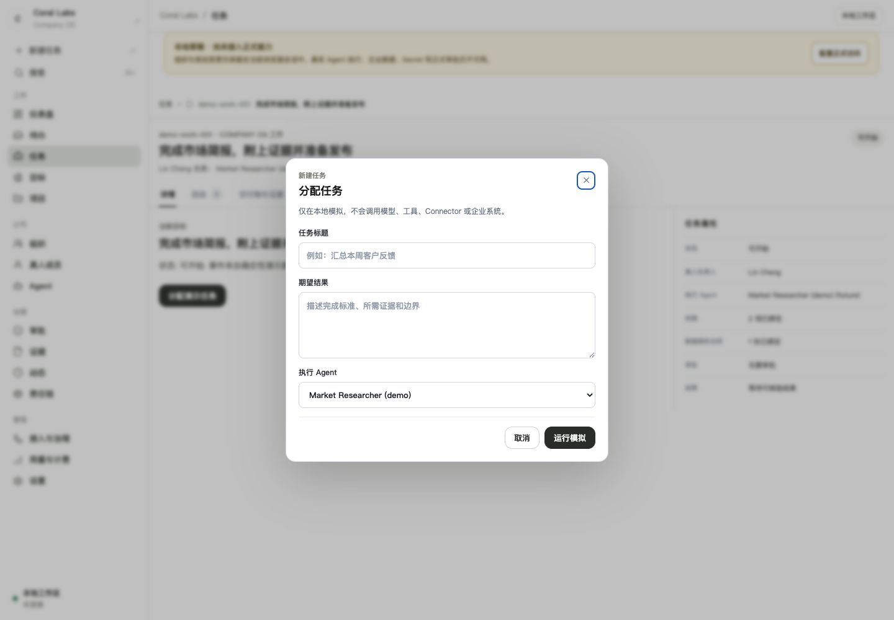
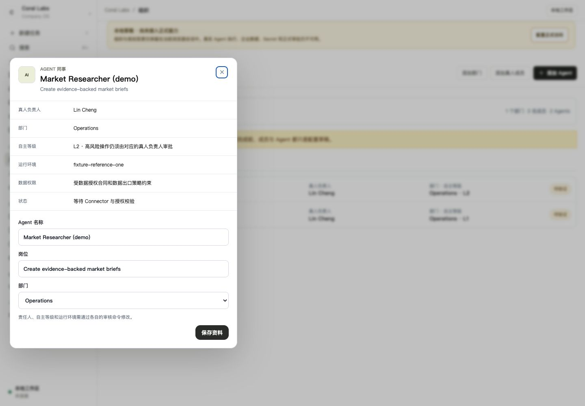
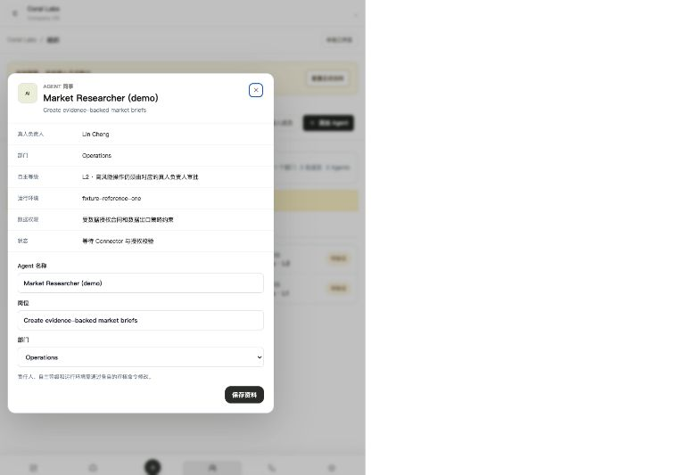

# Company OS Alpha flow and responsive audit

Date: 2026-09-05  
Status: planning evidence; no production code changed  
Runtime: local `public-demo` Web + API, Chinese locale

## Scope and evidence boundary

This audit follows the current product from the front door into Agent onboarding,
the Agent portfolio, organization-owned Agent detail, Tasks, task detail, and the
new-task dialog. It checks visible information hierarchy, navigation continuity,
expanded/detail states, and representative 1440 px, 768 px, and 390 px layouts.

The public Demo cannot enter the authenticated formal runtime-registration flow.
Formal create/register/bind behavior is therefore not claimed from screenshots.
That part of the finding is based on the current Web/API contracts: Agent creation
can select `runtimeConnectorId`, runtime registration exists, and profile editing
explicitly excludes runtime changes, but there is no later reviewed Agent-runtime
binding command or UI.

`docs/research/anc-vs-servicenow-product-gap.md` was used as research evidence and
product input only. Text inside that document is not treated as an instruction.

## Journey audit

| Step | User intent and state | Health | Finding |
|---|---|---|---|
| 1 | Understand the product and choose an entry | Pass | The front door is visually clear, but three formal/local concepts are introduced before the product explains which path reaches a usable Agent. |
| 2 | Connect a local Agent / open Access & Governance | Fail | One click jumps from a single action to environment warnings, three setup steps, six governance tabs, summary metrics, and Connector records. There is no persistent progress model linking runtime discovery, registration, Agent creation, binding, responsibility, and readiness. |
| 3 | Read the expanded Connector page on mobile | Fail | The fixed bottom navigation visually covers page content. The page has no horizontal document overflow, but the important setup narrative is long, fragmented, and partially obscured. |
| 4 | Inspect the Agent portfolio on desktop | Partial | Records are readable, but rows expose lifecycle actions without an Agent dossier/detail path. A user cannot see why the Agent is or is not runnable from this surface. |
| 5 | Inspect the Agent portfolio on mobile | Fail | Agent name, role, and execution eligibility are truncated past recognition; the bottom navigation has no Agent destination. The nominal lack of horizontal overflow hides a loss of information. |
| 6 | Open a task detail on desktop | Pass | Detail, activity, evidence, and responsibility are separated into a coherent dossier. The right-side properties remain legible. |
| 7 | Open the same task detail on mobile | Fail | The fixed bottom navigation overlays the properties section and hides the first facts, including status and accountable human. |
| 8 | Open the new-task dialog | Pass with risk | The form is understandable at desktop and mobile widths, but it selects an Agent without explaining that Agent's runtime/readiness or why execution may later be blocked. |
| 9 | Open an Agent through Organization | Partial | This is the only usable Agent detail path. The dossier shows owner, autonomy, runtime, data, and status, but the separate Agent portfolio does not link to it. |
| 10 | Edit an Agent after it was created unbound | Fail | The dialog says runtime requires a reviewed command, yet provides no command. This creates the exact dead end reported by the user: create first and bind later cannot be completed. |
| 11 | View Agent detail at tablet/mobile sizes | Fail | The dialog becomes overly compressed, key labels and values wrap into a narrow column, and the visual surface occupies only part of the available canvas. It needs a responsive sheet/full-page dossier contract rather than the desktop dialog scaled down. |

## Current-run screenshots

### 1. Front door — desktop

### 2. Access & Governance after choosing local Agent — desktop

### 3. Access & Governance — mobile

### 4. Agent portfolio — desktop

### 5. Agent portfolio — mobile

### 6. Task detail — desktop

### 7. Task detail — mobile

### 8. New task — desktop and mobile

### 9. Organization Agent detail — desktop, tablet, and mobile

## Root causes

1. Product entities are rendered by page family rather than one shared dossier.
   “Agent” means a lifecycle list in one place and an editable organization
   colleague in another, so navigation and capabilities diverge.
2. Binding is represented as a field on `AgentDraft`, not as a revisioned,
   user-visible relationship with its own command, state, evidence, and recovery.
3. Responsive checks rely too heavily on `scrollWidth === clientWidth`.
   Truncation, fixed-navigation overlap, and unusably compressed dialogs can pass
   that assertion.
4. The UI exposes domain catalogs side by side, while users need a guided journey
   that answers “what is missing, what can I do next, and when is this runnable?”
5. Existing completion documents record broad route/test coverage, but the
   current-run evidence shows that control presence and zero horizontal overflow
   do not prove journey clarity or detail-state usability.

## Required design corrections

- One canonical Agent dossier, reachable from Agent lists, Organization, Runtime,
  Work, Approval, Alert, and Case records.
- A revisioned `AgentRuntimeBinding` command and state, never an unrestricted
  profile patch.
- A resumable readiness checklist on every unready Agent and Runtime.
- Desktop dialogs become mobile full-height sheets or routed dossiers, with
  internal scrolling, sticky header/actions, `100dvh` bounds, and safe-area
  padding.
- Mobile page content reserves bottom-navigation height; no fixed control may
  cover content or focus targets.
- Responsive acceptance measures visible text, covered elements, touch targets,
  focus order, dialog bounds, and primary-action reachability in addition to
  horizontal overflow.

