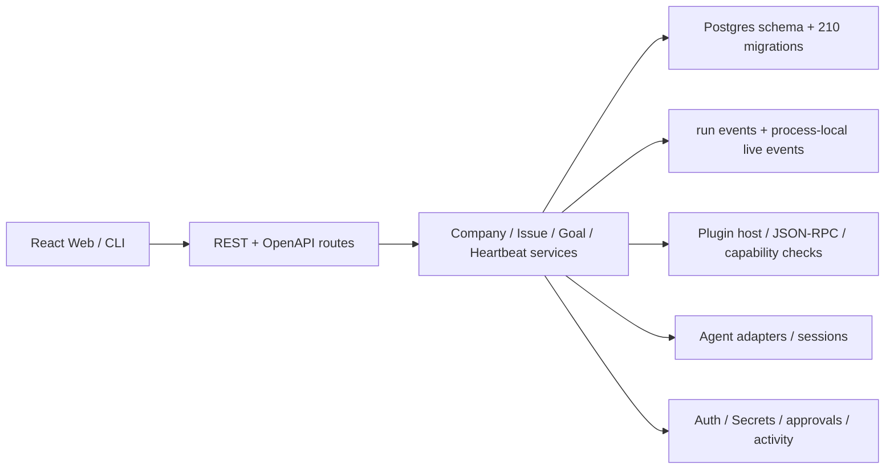
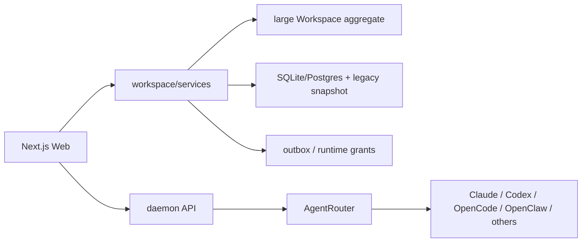
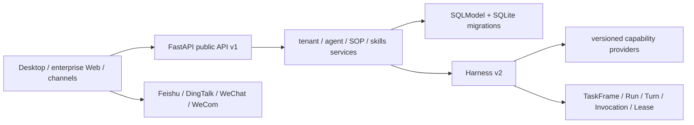
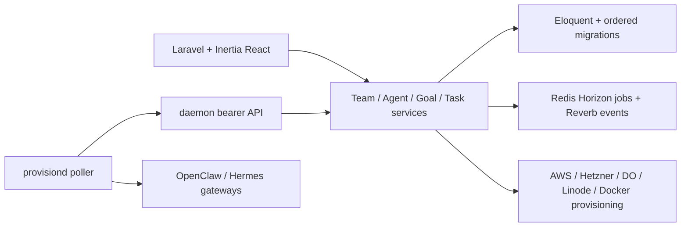

# Company OS 第一优先级开源竞品架构审计

状态：决策审计完成，等待用户确认产品方向  
证据截止：2026-08-19  
范围：Paperclip、AgentSpace、StaffDeck、Provision  
评价坐标：独立开源、真人—Agent 责任、国内企业/FDE、平等 Connector、
managed-cloud 与 self-hosted、温暖而有生命感的产品体验

## 1. 方法与证据边界

本轮不再以逐文件清零为完成标准。四个仓库均固定一个版本，生成完整
tracked-path inventory，并沿领域模型 → 数据库 → API/事件 → 执行 →
Connector/插件 → 身份权限 → 审批 → Secrets → 部署 → Web → 测试/升级的
端到端主链阅读代表性关键代码。

Paperclip 已有 704/1,560 个细粒度单元完成，作为可信附录保留；856 个
pending 不再追求清零。其他三个项目不把抽样说成全文件审计。因检出目录
没有安装依赖，AgentSpace、StaffDeck、Provision 的代表性测试命令均无法
启动；本报告只评价测试代码和 CI 结构，不声称运行通过。

## 2. 固定版本与覆盖清单

| 项目 | 固定版本 | 许可证 | 清单 | 活跃度/覆盖 | 结论 |
| --- | --- | --- | --- | --- | --- |
| Paperclip | `v2026.817.0` / `213dabab4f8e1f3bb1803a2924c0fea1289fcd4c` | MIT | 4,464 tracked paths；1,560 audit units | 大型活跃 monorepo；704 个细粒度单元完成 | `REFERENCE ONLY` 整体；若干机制 `ADAPT` |
| AgentSpace | `0f9da1b125def4d5a0d05b34bf7c5cec0686bbf2` | Apache-2.0 | 758 paths；78 units | 142 commits；无稳定 tag | `NARROW` / 选择性 `ADAPT` |
| StaffDeck | `v0.4.1` / `b18aebb9523cb32363b18806d258b0cf28e8781d` | AGPL-3.0-only | 757 paths；33 units | 921 commits；测试面广 | `REFERENCE ONLY`，除非主动接受 AGPL |
| Provision | `535cdbd651a47bff3ef583b4450fe337326c89ad`（最近 daemon tag `provisiond-v0.4.0`） | MIT | 1,023 paths；71 units | 226 commits；Laravel + daemon | `NARROW` / 部署经验 `ADAPT` |

Inventories 是仓库覆盖证明，不是“每行都已读”的声明：
`inventories/{agentspace,staffdeck,provision}.json`；Paperclip 使用
`research/paperclip/repository-inventory.json` 与 `unit-assessments.json`。

## 3. Paperclip

能力地图：通用 Goal/Issue/Run/Heartbeat/Budget/Artifact 最完整；Postgres
迁移、锁、幂等、恢复、插件 capability fail-closed、Secret 引用与脱敏、
release gates 成熟。其问题不是“功能不够”，而是所有类型共同形成
Paperclip 自己的产品模型。

关键数据模型：Company、Agent（Agent→Agent 汇报）、Goal、Issue、
HeartbeatRun、Approval(JSON payload)、Artifact、Budget/Incident、Secret
及版本、Plugin namespace。它没有 Company OS 所需的混合 Principal、
revisioned ResponsibilityContract 和精确 action digest 审批主体。

关键判断：

- 数据库和执行：采用 advisory/row lock、幂等、fencing、单调状态、
  terminalize-before-release、迁移 checksum/safety lint 等不变量；不复制
  schema、210 个 migration 或 18k 行 heartbeat service。
- API/事件：OpenAPI 覆盖较广，但错误 code 非强制，company live event 是
  进程内 EventEmitter；Company OS 必须使用结构化错误和 transactional
  outbox/replay cursor。
- 插件/Connector：版本化 JSON-RPC、manifest、unknown capability fail-closed
  值得独立实现；Paperclip adapter/session/type 不进入 Company OS core。
- 权限/审批/Secrets：并发审批的 conditional update、tenant-before-object、
  last-owner race protection、Secret access/rotation/redaction 值得借鉴；
  generic approval payload 和 monolithic Secret service 不复制。
- Web/部署：客户 UI、品牌、页面、API client、内部状态和整站部署均不复用。

成熟度：**4/5**。强工程体系，但安全审计曾在固定锁文件发现高危依赖，
生产镜像安装多个 `@latest` CLI，且服务边界与 Company OS 责任模型耦合。

## 4. AgentSpace

能力地图：workspace 协作、文档/频道/消息/任务、远程 daemon、多个 CLI
Agent router、运行访问申请和基本风险策略。最有价值的是混合云/本地 daemon
形态与多 CLI 生命周期适配经验。

关键数据模型：Workspace 大聚合、Member、Employee/Agent、Channel、Message、
Document、Task/Run/Event、RuntimeGrant、AccessRequest、Integration/outbox。
数据库同时保留 normalized tables 与 legacy `workspace_snapshot` JSON；审批仍
写入 workspace state，形成双重真相源。

关键判断：

- `AgentRouter` 有 session、事件、timeout、cancel、approval callback，但请求
  携带 raw env、private session ID 和厂商字段，不可作为中立 Connector。
- Approval 以 toolName/toolInput JSON 去重，却不记录 reviewer identity；没有
  exact digest、责任合同、权限/证据/结果绑定。
- Agent action policy 默认允许多数动作；外部不可信消息默认可存储、搜索并
  注入 Agent context，和 Company OS 数据出口/提示注入边界冲突。
- RuntimeGrant 只到 workspace/use 范围，不是 purpose/work-bound grant。
- SQLite/Postgres 双路径和 snapshot 迁移缺少成熟的顺序 migration/rollback。

成熟度：**2.5/5**。产品跨度大、daemon 方向有价值，但核心状态、审批和数据
政策不足以承载企业责任。Apache-2.0 允许合规复制，当前仍只批准窄模式
`ADAPT`，未批准任何文件 `ADOPT-CODE`。

## 5. StaffDeck

能力地图：本地优先 Agent 产品、Harness v2、版本化 capability、公开 API、
幂等、webhook outbox、SOP/skill、中文企业渠道、桌面打包、定时任务和人工
handoff。其 durable invocation 是四项目中最值得学习的单次执行机制。

关键数据模型：Tenant/User/APIClient/APICredential/APIIdempotencyRecord、
APIJob/Event/WebhookDelivery、AgentProfile、Skill/Version/Branch、SOP
Draft/Version、ModelConfig、TaskFrame/Run/Turn/SessionLease/Invocation、
HumanHandoffRequest、channel inbox/outbox。

关键判断：

- Invocation 冻结 capability，执行前重新授权，用 logical action key 防重，
  对无法确认的外部副作用记录 `outcome_unknown`：这是 Company OS 必须吸收的
  生产不变量。
- HumanHandoff 解决澄清/恢复，不等于精确动作审批；`confirm_side_effect` 是
  请求 flag，不是独立真人签署的责任决定。
- Sandbox 默认关闭、网络默认全开；Windows 不可用时会退化为 unsandboxed，
  不满足 Company OS 生产默认安全基线。
- API key 设计具备 hash/scope/expiry/revoke、稳定 error code 和 idempotency；
  模型 key 则依赖单个 `APP_SECRET` 派生 Fernet，工具 JSON 仍可能含 Secret。
- 数据升级以 SQLModel `create_all` 和大型 SQLite ad-hoc migration 为主，
  不宜作为企业数据库基线。

成熟度：**3/5**。运行时思想和国内渠道很强，生产数据库、sandbox、Secret、
责任审批不足。AGPL-3.0-only 使服务端复制/Fork 带来网络使用源码义务；默认
只做 clean-room `REFERENCE ONLY`，除非 Company OS 明确选择 AGPL。

## 6. Provision

能力地图：Agent 招聘/组织图、Goal/Task、task checkout、daemon heartbeat、
OpenClaw/Hermes harness、云主机与 Docker 部署、Slack/Telegram/Discord/
Email/Web 渠道、审批、Artifact、用量和实时 chat relay。

关键数据模型：Team/User/member role、Server/daemon token、Agent/reports_to、
Goal、Task/checkout lease/delegation、Approval、AuditLog、WorkProduct、Usage、
TeamApiKey/EnvVar、channel connection、chat/session relay。

关键判断：

- `TaskCheckoutService` 使用 transaction + row lock + lease，是简单清楚的工作
  领取参考；但 result 接口没有以 checkout run 做 compare-and-set，重试可能
  重复累计 token、创建 work products/delegations/approvals。
- daemon 先执行 Agent，再从模型文本解析 `approval_requests` 并上报阻塞；
  审批不是在外部副作用前对 exact action/digest 授权。
- 审批记录 reviewer 和 linked task，优于 AgentSpace，但 payload 仍是 raw JSON，
  approve 后把任务置回 todo，没有 approval consumption/fencing/supersession。
- work queue 将 `api_server_key` 明文下发给 server-scoped daemon；团队 API key、
  env、daemon/root/VNC/channel secrets 主要依赖 Laravel 单 APP_KEY encrypted cast，
  没有 purpose-bound Secret lease/provider port。
- HarnessDriver 只覆盖安装/更新/删除/健康/配置，不是 task/progress/evidence/
  pause/resume/cancel 的 Connector contract。
- Docker compose 直接挂载 host Docker socket，且开发启动时在线安装依赖；适合
  本地体验，不是 hardened self-host 基线。

成熟度：**3/5**。部署面和测试数量可观，责任/幂等/Secret/执行契约仍是早期。
MIT 允许窄复用，但当前批准的是云 provider abstraction、signed installer、
daemon upgrade/heartbeat、checkout lease 等设计 `ADAPT`，不是 Fork。

## 7. 跨项目能力矩阵与唯一最佳参考

“最佳参考”不是依赖或共同 owner；Company OS 始终拥有最终契约。每行只有一个
参考来源，避免把同一领域拼成多套实现。

| 能力 | 唯一最佳参考 | 理由 | Company OS 动作 |
| --- | --- | --- | --- |
| 通用 Goal/Task/Run/Budget/Artifact/Heartbeat | Paperclip | 覆盖和恢复不变量最完整 | `ADAPT` 不变量，自有 schema/API |
| 单次 invocation 幂等与未知副作用 | StaffDeck | logical action key、lease、`outcome_unknown` 最清楚 | clean-room `ADAPT` |
| DB migration / backup / extension namespace | Paperclip | checksum、锁、安全 lint、失败账本成熟 | 独立实现 |
| Plugin/extension host | Paperclip | versioned JSON-RPC、manifest、capability fail-closed | 缩小后独立实现 |
| 多 CLI Agent 本地执行适配 | AgentSpace | router 覆盖厂商较广 | 仅学习 adapter 分层；删除 raw env/session |
| 云主机/Docker Agent 部署 | Provision | provider abstraction、installer、daemon upgrade 端到端 | `ADAPT`，不挂 Docker socket 作为生产默认 |
| 国内企业渠道与 SOP/skill | StaffDeck | 飞书/钉钉/微信/企微及版本化 SOP 最贴近市场 | clean-room 实现，保留 Connector 边界 |
| Secret 生命周期 | Paperclip | provider/version/rotation/access/redaction 最完整 | 自有 SecretPort + threat model |
| 并发审批决策 | Paperclip | conditional update 和 cross-tenant validation 更严谨 | 加上 Company OS exact subject/digest |
| 混合真人/Agent 组织与责任合同 | Company OS | 四项目均不满足 | **自有 canonical domain** |
| 数据授权合同与出口防火墙 | Company OS | 四项目均未提供完整 purpose-bound 模型 | **自有 canonical domain** |
| 独立中文温暖 Web/虚拟办公室 | Company OS | 四项目 UI 都不符合品牌和 renderer-neutral 方向 | **自有 Web + Office Compiler** |

## 8. 许可证、可复用与禁止边界

- MIT（Paperclip、Provision）：可复制时必须保留 copyright/license；仍需逐文件
  provenance、原 SHA、复制前后 hash、本地修改和测试。当前没有批准复制代码。
- Apache-2.0（AgentSpace）：还需保留 NOTICE/变更声明并注意专利条款；当前无
  已批准复制文件。
- AGPL-3.0-only（StaffDeck）：修改并通过网络提供服务通常触发对应源码提供
  义务。除非 Company OS 主动接受 AGPL，禁止直接复制服务端/前端或 Fork；
  仅 clean-room 学习思想。
- 一律禁止复制：名称、Logo、商标、品牌资产、完整页面、业务文案、私有/EE
  代码、竞争者数据库 schema/type graph、凭据、fixture 中的敏感数据。

## 9. 竞品已解决而 Company OS 需补入架构的问题

1. 外部副作用“结果未知”不是普通失败，必须单列 `outcome_unknown` 并禁止盲重试。
2. 运行时 capability 必须在创建工作时冻结、执行前重授权，防止权限漂移。
3. checkout lease 之外还需 fencing token；所有结果、证据和成本写入都绑定 attempt。
4. 投影/事件需要 durable outbox、cursor、checkpoint；WebSocket 不是真相源。
5. Secret access 成功与审计失败的顺序必须 fail closed 或形成可恢复的强证据。
6. 插件/Connector 要分 trust tier，语言 VM 不是恶意代码安全边界。
7. schema 迁移要有 checksum、advisory lock、安全 lint、expand/contract 和恢复演练。
8. managed-cloud 与 self-hosted 需要相同 compatibility suite 和数据出口/退出包。

## 10. 最终项目级判断

| 项目 | GO / NARROW / PARTNER / STOP | Fork? | 结论 |
| --- | --- | --- | --- |
| Paperclip | `NARROW` | 否 | 最佳通用控制面工程参考，不是 Company OS 基座 |
| AgentSpace | `NARROW` | 否 | 参考多 CLI daemon，不采用 workspace/domain/approval |
| StaffDeck | `PARTNER`/`NARROW` | 默认否 | 国内生态和 Harness 值得合作/学习；AGPL 阻止随意复制 |
| Provision | `NARROW` | 否 | 参考部署/daemon；不采用责任、Secret 和运行契约 |

四个项目都不应整体 Fork。选择性合法复用必须由未来单独 ADR 和 provenance
变更批准；本轮未复制任何竞品代码。
