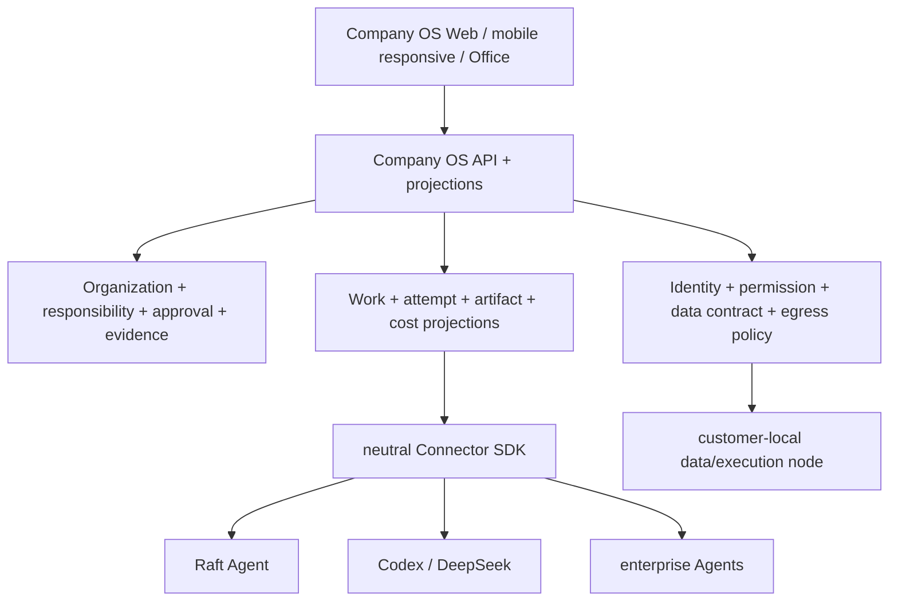

# Company OS 产品形态决策简报

状态：建议已形成，等待用户确认；重叠实现继续冻结  
日期：2026-08-19

## 一句话结论

建议选择 **方向 B：责任优先的 AI Native Company System of Record + Agent
Boss 执行控制面**。它不是另一个通用 Agent 编排器，也不是只有资产清单的
治理 overlay；它把真人负责人、Agent、权限/数据合同、审批、证据和结果做成
同一条可执行责任链，并用独立温暖 Web 与办公室体验成为日常工作入口。

## 三种互斥方向

### 方向 A：通用开源 Agent 编排/运行平台

核心对象是 Goal/Task/Run/Heartbeat/Plugin，直接与 Paperclip、AgentSpace、
StaffDeck、Provision 争夺开发者。优势是容易解释和自部署；代价是高度同质化，
且 Paperclip 已有显著工程深度。若选择 A，真人责任、办公室和国内 FDE 会退化
为附加功能。

判断：**STOP 作为产品主形态**。只吸收这些项目已证明的运行不变量。

### 方向 B：真人责任优先的 Company System of Record（推荐）

核心对象是 Organization、HumanPrincipal、AgentPrincipal、Role/Position、
ResponsibilityContractRevision、Work、ExecutionAttempt、AuthorizationGrant、
DataContract、ApprovalSubject、Evidence、Outcome。通用 runtime 通过 Connector
接入；Company OS 不与厂商 Agent 争夺“谁来推理”，而负责“谁能做、为何做、
由谁负责、用了什么、谁批准、证据和结果是什么”。

产品入口是 Agent Boss 工作台 + living company/虚拟办公室；交付方式是开源
self-hosted、managed-cloud 和 FDE 行业模板。方向 B 能同时承接 Workday/
Microsoft/ServiceNow 的治理需求、Presence 的 FDE 生产闭环，以及 Sintra 的
低门槛团队感，但不依赖任何一家生态。

判断：**GO**。

### 方向 C：温暖的 SMB AI Workforce / 虚拟办公室

核心对象是预制 AI 同事、角色、共享上下文、自动化和订阅，直接对标 Sintra、
Relevance AI、Lindy。优势是演示性和增长快；代价是企业身份、数据责任、
部署和可审计性容易被简化，3D/内容资产会过早吞噬工程资源。

判断：**NARROW**。只把它作为方向 B 的 Demo/体验壳，不作为 canonical core。

## 推荐产品边界

Company OS 自有：产品领域、API/event schema、责任链、IdentityPort、DataPort、
Connector contract、中文/英文语言边界、Web、办公室编译器、部署 profiles、
FDE template format、迁移和数据退出。

竞品只作为参考：Paperclip 的 durable control-plane 不变量；StaffDeck 的
invocation 与国内渠道；AgentSpace 的多 CLI daemon；Provision 的云部署；
商业产品的 registry、AI asset inventory、FDE rollout、warm onboarding。

## 商业竞品给出的产品边界

| 产品 | 应学习的边界 | 不跟随的边界 | 判断 |
| --- | --- | --- | --- |
| Workday ASOR | delegate/ambient 身份分离、skill-scoped ASU、真人/Agent workforce record | Workday HCM/Finance tenant 锁定 | `PARTNER`/`REFERENCE` |
| Microsoft Agent 365 | owner/sponsor/manager registry，Entra/Purview/Defender 治理 | per-user Microsoft license 与 M365 数据引力 | `PARTNER` |
| ServiceNow AI Control Tower | AI asset/identity/model/MCP inventory、steward approval、CMDB/ROI | ServiceNow workflow/CMDB 锁定 | `PARTNER` |
| Salesforce Agentforce | action metering、CRM action/channel deployment | CRM-native proprietary runtime | `NARROW` |
| Relevance AI | workforce builder、edge approval、activity view | hosted no-code runtime 持有全部数据 | `NARROW` |
| Sintra | 零门槛 named team、共享 context、温暖入口 | 弱企业责任/权限/部署 | `NARROW` |
| Lindy | 消息入口、默认草稿审批、企业 SSO/SCIM/audit | 个人助理/inbox 中心模型 | `NARROW` |
| Artisan / 11x | audit→design→deploy→scale 的 FDE 与白手套交付 | 单一 GTM vertical、代人发送与替代员工叙事 | `NARROW` |
| OpenAI Presence | job-scoped permissions、simulation/eval、人工批准 rollout、持续改进 | OpenAI-only managed limited GA | `PARTNER`/`REFERENCE` |

这些结论基于截至 2026-08-19 的官方公开材料；未公开的价格、schema、数据
驻留、退出能力和责任合同仍明确标为 unknown，不从营销文案推断实现。

## 采用后应停止与继续的工作

停止自行扩张：第二套通用 Task/Run scheduler、通用 Plugin host、厂商专属
session 进入 core、整站复制/汉化竞品 UI、在 3D 前制作角色/场景资产。

用户确认方向 B 后恢复，顺序为：

1. 固化责任优先领域模型、attempt fencing、outbox 和 migration safety；
2. 定义 Connector SDK、Secret/Data/Identity ports 和本地执行节点协议；
3. 完成确定性 Demo 三分钟责任闭环与 Agent Boss MVP；
4. 完成模型/数据/权限/出口管理与 FDE template；
5. 完成响应式自有 Web、Pre-3D Office Compiler 和 renderer contract；
6. 全部 focused unit/integration/E2E、类型、构建和边界守卫通过后停在正式
   3D 角色、场景、骨骼和动画资产之前。

## 决策请求

请用户确认是否接受方向 B。确认前，重叠的通用 Agent 管理与 Pre-3D 产品
实现继续冻结；审计文档、许可证/provenance 和必要的安全修正可以继续。
